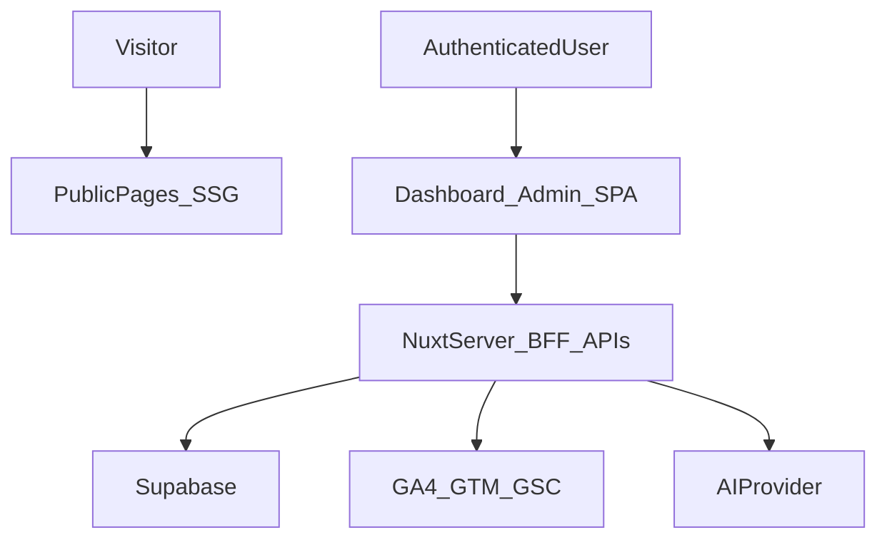

# Hybrid Rendering Refactor Guide

## Goals
- Serve public pages as prerendered static content for SEO and speed.
- Keep authenticated product surfaces app-like and resource-efficient.
- Enforce role-based boundaries in both middleware and server APIs.
- Standardize quality gates across linting, type-checking, testing, and debugging.

## Rendering Map

### Route behavior
- Public pages prerendered: `/`, `/about`, `/privacy`, `/terms`, `/contact`.
- App pages rendered as SPA: `/admin/**`, `/dashboard/**`.
- Legacy route compatibility kept: `/:client` and `/:client/:project` redirect into `/dashboard/**`.

## Role and Access Model

| Role | Public pages | `/admin/**` | `/dashboard/:client/:project` | `/api/admin/**` | `/api/projects/:client/:project` |
| --- | --- | --- | --- | --- | --- |
| Visitor | Allowed | Redirect to login | Redirect to login | Denied | Denied |
| Client | Allowed | Denied | Allowed only for own `:client` | Denied | Read only for own `:client` |
| Admin | Allowed | Allowed | Allowed for any client | Allowed | Read + write |

## BFF Boundaries
- Client never talks directly to Google/AI providers.
- Sensitive tokens and API keys remain server-only in `runtimeConfig`.
- Integration refresh operations are server-side and now rate limited.

## Implemented Refactor Changes

### 1) Hybrid rendering setup
- Enabled SSR globally and introduced route-level hybrid behavior in `nuxt.config.ts`.
- Added route rules for public prerendering and SPA app routes.

### 2) Route migration and compatibility
- Introduced canonical dashboard namespace under `/dashboard/:client/:project`.
- Updated login/admin navigation to use `/dashboard/**`.
- Added compatibility redirects:
  - `/:client/:project` -> `/dashboard/:client/:project`
  - `/:client` -> resolved dashboard path via authenticated user info.

### 3) Auth hardening and abstractions
- Added shared server auth utilities:
  - `getSessionUser`
  - `requireAdmin`
  - `requireClientScope`
- Refactored project and integration APIs to use shared auth guards.
- Added `GET /api/auth/me` endpoint for safe client-side redirect logic.

### 4) Dashboard performance and code-splitting
- New dashboard route page uses lazy-loaded tab panels:
  - `LazyClientDashboardTabCRO`
  - `LazySiteHealthPanel`
- Added dedicated `admin` layout and explicit dashboard layout usage.

### 5) API resilience and limits
- Added in-memory request throttling utility for sensitive refresh endpoints:
  - GTM refresh
  - GA4 refresh
  - GSC refresh

## Linting, Type Checking, and CI Gates

### NPM scripts
- `npm run lint` now covers all critical app and server folders.
- `npm run typecheck` validates TypeScript usage.
- `npm run test:unit` runs Vitest unit suite.
- `npm run test:e2e` runs Playwright flows.
- `npm run check` runs: lint -> typecheck -> unit tests.

### Suggested CI pipeline
1. Install dependencies.
2. Run `npm run lint`.
3. Run `npm run typecheck`.
4. Run `npm run test:unit`.
5. Optionally run `npm run test:e2e` on preview/staging or nightly.

## Testing Matrix

### Unit tests (Vitest)
- UI component behavior (`components/ui`).
- URL/project slug normalization utilities.
- Additional role/guard utility tests (recommended next).

### E2E tests (Playwright)
- Public landing accessibility.
- Unauthenticated redirect to login for dashboard routes.
- Admin auth flow and admin UI visibility.
- Recommended next:
  - Client own-dashboard access pass.
  - Cross-client access deny.
  - Legacy URL redirect checks.

## Debugging Toolkit

### Core tools
- **Nuxt DevTools**: route rendering mode, component tree, payload inspection.
- **Browser DevTools**:
  - Network tab for API auth and BFF calls.
  - Performance tab for tab-switch and lazy-load timing.
- **Playwright trace viewer**: reproduce flaky E2E behaviors.
- **Server logs**: auth guard denials, integration request failures, and rate-limit events.

### Debug playbooks
- **Redirect loops**: verify middleware target route and `/api/auth/session` status.
- **Role leakage**: confirm server guard (`requireAdmin`, `requireClientScope`) on endpoint.
- **Hydration mismatch**: ensure page route uses intended SSR/SPA policy.
- **Slow dashboard**: confirm tabs are lazy-loaded and payload size from APIs is bounded.
- **Integration failures**: validate token state and endpoint-level error messages.

## Migration and Rollback Notes
- Migration is backward compatible by keeping legacy client routes as redirects.
- If rollback is needed:
  1. Revert dashboard URL rewrites in login/admin navigation.
  2. Disable new route rules for dashboard namespace.
  3. Keep auth utility layer (safe, low risk) as technical baseline.

## Recommended Next Iteration
- Add shared API schema validation (e.g. `zod`) for request bodies.
- Add integration tests for server API authorization matrix.
- Add structured logging correlation IDs for easier production debugging.
